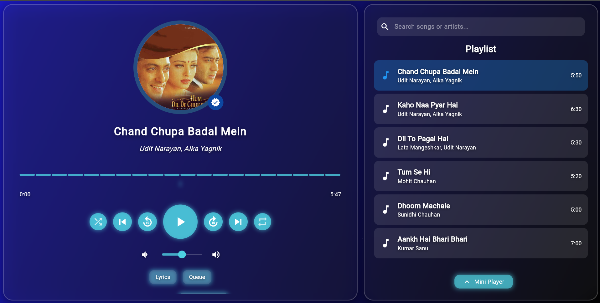
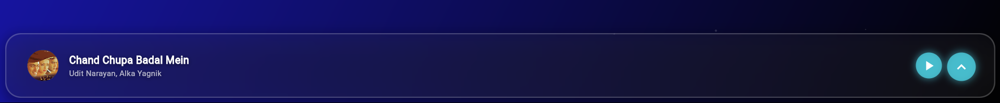

<h1 align="center">
  🎧 Premium Music Player UI - Flutter
</h1>

<p align="center">
  
  
  
</p>

<p align="center">
  
</p>


---

## 🎨 UI Preview

<div align="center">
  

</div>

---

## 🛠 Features

- 🎵 Play local audio with **assets_audio_player**
- ✨ Glassmorphic + blur UI effects
- 🎨 Custom artwork & animated sliders
- 🗂 Song metadata support (title, artist, duration)
- 📃 Optional lyrics integration
- ⚡ Smooth navigation and responsive design

---

## 🚀 Getting Started

```bash
git clone https://github.com/Adarsh-Kumar6534/Music-Player-UI-_-Flutter.git
cd Music-Player-UI-_-Flutter
flutter pub get
flutter run
```
## 📦 Packages Used

| Package                  | Description                     |
|--------------------------|---------------------------------|
| `assets/songs`    | For audio playback              |
| `flutter_blur` or `BackdropFilter` | For UI blur/glass effect |
| `material` & `dart:math` | Core design & animations        |

## 📱 Screenshots

| Home Screen                                 | Player UI                                  |
|---------------------------------------------|---------------------------------------------|
|  |  |

## 🙌 Author

**Adarsh Kumar** – [GitHub](https://github.com/Adarsh-Kumar6534)

> Passionate about Flutter, UI design, and music tech!
